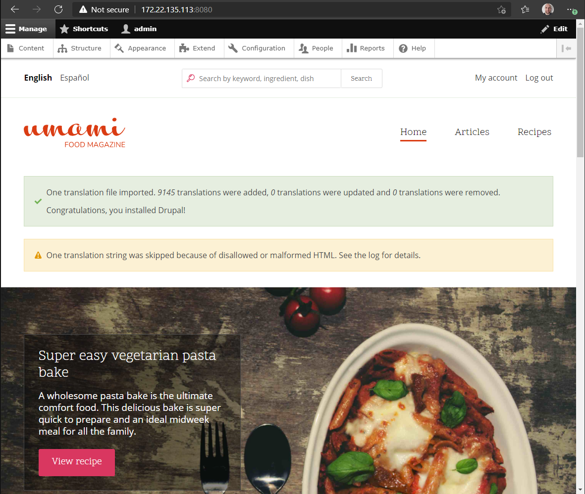

# 201 - anatomy of a stateful deployment

# foodmag - a blog about food!

Within 101, a simple Pod definition was used to provision a container with a persistent volume,  deleting the pod, the action is direct and definitive but still let the persistent volume usable.  

From a k8s standpoint, a stateful application is a first class citizen and as such has it's own definition called a [StatefulSet](https://kubernetes.io/docs/concepts/workloads/controllers/statefulset/).  
Note that deleting a StatefulSet, Pod(s) are not deleted but scaled down to 0. Scaling down a Satefulet to 0 could provide a ordered and graceful termination of the pods.

In this chapter, a typical CMS application will be deployed using a StatefulSet and PVCs. This CMS is composed of:
- a web app written in PHP called Drupal
- a database using PostgreSQL 
- Drupal food magazine demo data will be used to highlight persistent storage

Drupal is well know solution used by enterprise companies. Being written in PHP, it requires multiple dependencies like system & PHP libraries, an Apache server with PHP module, and a database service. The actual [installation guide](https://www.drupal.org/docs/installing-drupal) is quite long and extensive.

The next sections will provide a breakdown of the different configuration objects necessary to have a working stateful application for production grade usage.

The following diagram shows the expected results, each discrete elements will be explained and configured:  


## the old empire
With this short section, let's imagine would it would be done provision, configure and deploy such a simple architecture. This breakdown could be considered as a worklow from an automation and release tooling perspective:

1. define two network zones (nightmare time!)
1. get IP addresses (hoping there is an IPAM)
1. configure DNS
1. provision at least 2 (virtual) machines
1. update the operating systems to the latest corporate release if golden image is not yet
1. configure the operating systems with the latest and greatest access policies
1. deploy backup, security and auditing packages
1. deploy observability packages
1. configure additional storage for both (virtual) machines
1. deploy DB service on one (virtual)machine 
1. deploy CMS service on one (virtual)machine
1. check connectivity and adjust firewall
1. request SSL certificate for external exposure
1. configure load balancer for external exposure
1. check external exposure
1. Dev team to access, verify and confirm all good and most likely requests some additional libs or packages to be deployed
1. Dev team to load the contents 
1. configure CMS & DB backup
1. configure system level backup

By experience, the above would have a lead time between 1 week (impressive) up to months!  

## the new republic
Taking the above into consideration, let's try to build a table to address each elements from one world to another. 

|tasks|k8s|
|-----|---|
|1,2,3,7,8,12,13*,14*|abstracted by k8s platform
|4,5,6|container spec definition of StatefulSet & rollout strategies
|     |container image management for life-cycle
|9    |volumeMounts settings within the container & volumeClaimTemplates spec
|10,11|container spec definition of StatefulSet
|     |container image management for life-cycle
|15,16,17|abstracted by Continuous Deployment
|18   |Ops

Notes: 
- ```abstracted by k8s platform``` means the necessary components are deployed and available to developers using k8s API object constructs like annotations, labels, API objects, ... 
- ```*``` should be totally abstracted but some organizations wants control SSL and load balancer configuration mostly because of lack of trust and/or automation skills.

# statful application deployment

## namespace - segmentation and multi-tenancy
k8s by definition is a platform to be shared with many teams to deploy many workloads. To avoid chaos, disaster and entropy, there is a need to give a ```space``` for each team projects to exist without impacting any others. This first segmenation and multi-tenancy attribute is called a ```namespace``` (also known as ```project``` for other k8s distributions) and provides features like:
- multi tenancy
- grouping objects together  
- cluster resources definition via quota
- explicit cluster resource partitioning from other namespace

 Official documentation: [namespace](https://kubernetes.io/docs/concepts/overview/working-with-objects/namespaces/)

k8s has a bunch of built-in namespaces, numbers are varying by k8s distributions and added components, to provide a clear segmentation between k8s components and workloads.

If not explicitly defined, any deployment will happen in the namespace called ```default```. This is obviously a bad practices and only appreciated when doing demo or introduction like in 101.  
Here, a namespace called ```foodmag-app``` will be created to group all the related resources for the stateful application. To create a namespace, the following configuration file can be applied:

```foodmag-app-namespace.yaml```:
```yaml
---
apiVersion: v1
kind: Namespace
metadata:
  name: foodmag-app
```
The above YAML is a perfect small sized example to present the structure:  
1. reference to an API version (it could also refer to a specific API set like ```apps/v1```)
1. reference to an API object, ```Namespace```, CRUD operations
1. reference to metadata defining a name for the obeject 
1. indentation, indentation, indentation!

To apply this configuration file, run the following:
```
kubectl apply -f doc/201/foodmag-app/v1/foodmag-app-namespace.yaml
namespace/foodmag-app created
```
The results will be followings:
```
kubectl get namespaces
NAME                 STATUS   AGE
default              Active   3d2h
foodmag-app          Active   16s
kube-node-lease      Active   3d2h
kube-public          Active   3d2h
kube-system          Active   3d2h
storageos-etcd       Active   2d11h
```

## statefulset - the desired state of a stateful application
The concept has been introduced at beginning of this chapter. For more details, do not hesitate to browse the [k8s statefulset documentation](https://kubernetes.io/docs/concepts/workloads/controllers/statefulset/). With no further suspens, here is the YAML for the StatefulSet with some comments.

```foodmag-app-statefulset.yaml```:
```yaml
apiVersion: apps/v1
kind: StatefulSet                                       #|> Calling the StatefulSet API object.
metadata:
  name: foodmag-app                                     #|> The name of our application, it will be used as a reference key for all related objects.
  namespace: foodmag-app                                #|> The name space in which all (almost) objects will exist.
spec:
  selector:
    matchLabels:                                        #|> Another kind of labels to refer to when configuring other objects like service as example
      app: foodmag-app
      env: prod
  serviceName: foodmag-app                              #|> ServiceName is the DNS name, serviceName-[id], to address the application with
  replicas: 1                                           #|> Number of instances to scale to; if 2, pods will have 2 instances running on two different nodes.
  template:                                             #|> The template is used to define the desired state of the application
    metadata:
      labels:                                           #|> Labels allows to ease searches like "show all prod objects"
        app: foodmag-app
        env: prod
    spec:
      containers:                                       #|> This section is used to define each container desired state.
        - name: foodmag-app-sql                         #|  Desired state is: a container called foodmag-app-sql based on the latest image of postgres.
          image: postgres:latest                        #|
          ports:
            - containerPort: 5432                       #|> This will inform that postgres has the port 5432 can be exposed and a name is given.
              name: foodmag-app-sql                     
          env:                                          #|> This will define environment variables that the container image can leverage to configure
            - name: POSTGRES_DB                         #|  the services running in it like here about setting up postgres. 
              value: foodmagappdb                       #|  
            - name: POSTGRES_USER                       #|
              value: foodmagapp                         #|
            - name: POSTGRES_PASSWORD                   #|
              value: foodmagpassword                    #|
            - name: PGDATA                              #|
              value: /var/lib/postgresql/data/pgdata    #|
          volumeMounts:                                 #|> This will define the appropriate PVC and its mount point.
            - name: foodmag-app-sql-pvc                 #|
              mountPath: /var/lib/postgresql/data       #|
        - name: foodmag-app-cms                         #|> Second container for the cms part.
          image: drupal:latest
          ports:
            - containerPort: 30080
              name: foodmag-app-cms
          volumeMounts:                                 #|> This will define the appropriate PVC and its mount point.
            - name: foodmag-app-cms-pvc                 #|  Note the subPath is a special construct to allow a single PVC to have multiple
              mountPath: /var/www/html/modules          #|  mount points for the same container. 
              subPath: modules                          #|
            - name: foodmag-app-cms-pvc                 #|
              mountPath: /var/www/html/profiles         #|
              subPath: profiles                         #|
            - name: foodmag-app-cms-pvc                 #|
              mountPath: /var/www/html/themes           #|
              subPath: themes                           #|
  volumeClaimTemplates:                                 #|> A special PVC template used to define the desired state for persistent storage.
    - metadata:                 
        name: foodmag-app-sql-pvc                       #|> PVC name prefix resulting in prefix-ServiceName-[id]
        labels:
          app: foodmag-app
          env: prod
      spec:
        accessModes: ["ReadWriteOnce"]                  #|> AccessMode is a very important topics. It will be covered later in this section.
        storageClassName: "storageos-rep-1"             #|> This will define the appropriate storageClass with features like replica, encryption, ...
        resources:
          requests:
            storage: 5Gi                                #|> This will define the provisioned disk size of the volume.
    - metadata:
        name: foodmag-app-cms-pvc                       #|> Second PVC definition
        labels:
          app: foodmag-app
          env: prod
      spec:
        accessModes: ["ReadWriteOnce"]
        storageClassName: "storageos-rep-1"
        resources:
          requests:
            storage: 5Gi
```

To apply this configuration file, run the following:
```
kubectl apply -f doc/201/foodmag-app/v1/foodmag-app-statefulset.yaml 
statefulset.apps/foodmag-app configured
```
The results will be followings:
```
kubectl get all -n foodmag-app -o wide
NAME                READY   STATUS    RESTARTS   AGE   IP            NODE          NOMINATED NODE   READINESS GATES
pod/foodmag-app-0   2/2     Running   0          11m   10.244.0.29   dbaas-8rowa   <none>           <none>

NAME                           READY   AGE   CONTAINERS                        IMAGES
statefulset.apps/foodmag-app   1/1     13m   foodmag-app-sql,foodmag-app-cms   postgres:latest,drupal:latest
```
The StatefulSet created one Pod with 2 running containers; one for the ```foodmag-app-sql``` and one for ```foodmag-app-cms```, shown within the StatefuleSet output.
```
kubectl get pvc -n foodmag-app
NAME                                STATUS   VOLUME                                     CAPACITY   ACCESS MODES   STORAGECLASS      AGE
foodmag-app-cms-pvc-foodmag-app-0   Bound    pvc-7dc38e7a-d28a-4c76-969d-4fe3958a0925   5Gi        RWO            storageos-rep-1   3h44m
foodmag-app-sql-pvc-foodmag-app-0   Bound    pvc-cc13bc1e-1d9b-4382-854a-3b9c12a5489b   5Gi        RWO            storageos-rep-1   3h44m
```
Two PVCs have been provisioned for each containers. Note that the above command outputs have an explicit usage of namespace ```foodmag-app```. Let's have a look without it:
```
kubectl get all
NAME     READY   STATUS    RESTARTS   AGE
pod/d1   1/1     Running   46         46h
pod/d2   1/1     Running   46         46h

NAME                 TYPE        CLUSTER-IP   EXTERNAL-IP   PORT(S)   AGE
service/kubernetes   ClusterIP   10.245.0.1   <none>        443/TCP   3d19h 
```
Not referring to a namespace will present the objects existing/created within the namespace called ```default``` and same goes for the PVCs:
```
kubectl get pvc 
NAME    STATUS   VOLUME                                     CAPACITY   ACCESS MODES   STORAGECLASS      AGE
pvc-1   Bound    pvc-f4af80a7-1224-4641-abae-8403e3c9827b   5Gi        RWO            fast              3d2h
pvc-2   Bound    pvc-3e303b09-dc6f-4cf7-b46a-d368463f629c   5Gi        RWO            storageos-rep-1   46h
```

Note that some objects can't be not attached to a specific namespace like the persistent volumes created from the PVCs even if explicitly requested with the ```foodmag-app``` namespace:
```
kubectl get pv -n foodmag-app
NAME                                       CAPACITY   ACCESS MODES   RECLAIM POLICY   STATUS   CLAIM                                           STORAGECLASS      REASON   AGE
pvc-3e303b09-dc6f-4cf7-b46a-d368463f629c   5Gi        RWO            Delete           Bound    default/pvc-2                                   storageos-rep-1            47h
pvc-7dc38e7a-d28a-4c76-969d-4fe3958a0925   5Gi        RWO            Delete           Bound    foodmag-app/foodmag-app-cms-pvc-foodmag-app-0   storageos-rep-1            4h30m
pvc-cc13bc1e-1d9b-4382-854a-3b9c12a5489b   5Gi        RWO            Delete           Bound    foodmag-app/foodmag-app-sql-pvc-foodmag-app-0   storageos-rep-1            4h30m
pvc-f4af80a7-1224-4641-abae-8403e3c9827b   5Gi        RWO            Delete           Bound    default/pvc-1                                   fast                       3d3h
```

This illustrates the concept of segmentation of resource opening doors to multi-tenancy. This will be investigated further within the Security chapter (501).

## statefulset - what's in the box?
At the current stage, the StatefulSet created a couple of objects:
- StatefulSet (1)
- Persistent Volume Claims (2)
- Pods (2)
- Persistent Volumes(2) 

The following command will provide the complete inventory: 
```
kubectl describe -n foodmag-app statefulset.apps/foodmag-app
Name:               foodmag-app
Namespace:          foodmag-app
CreationTimestamp:  Mon, 10 May 2021 11:18:35 +0200
Selector:           app=foodmag-app,env=prod
Labels:             <none>
Annotations:        <none>
Replicas:           1 desired | 1 total
Update Strategy:    RollingUpdate
  Partition:        0
Pods Status:        1 Running / 0 Waiting / 0 Succeeded / 0 Failed
Pod Template:
  Labels:  app=foodmag-app
           env=prod
  Containers:
   foodmag-app-sql:
    Image:      postgres:latest
    Port:       5432/TCP
    Host Port:  0/TCP
    Environment:
      POSTGRES_DB:        foodmagappdb
      POSTGRES_USER:      foodmagapp
      POSTGRES_PASSWORD:  foodmagpassword
      PGDATA:             /var/lib/postgresql/data/pgdata
    Mounts:
      /var/lib/postgresql/data from foodmag-app-sql-pvc (rw)
   foodmag-app-cms:
    Image:        drupal:latest
    Port:         30080/TCP
    Host Port:    0/TCP
    Environment:  <none>
    Mounts:
      /var/www/html/modules from foodmag-app-cms-pvc (rw,path="modules")
      /var/www/html/profiles from foodmag-app-cms-pvc (rw,path="profiles")
      /var/www/html/themes from foodmag-app-cms-pvc (rw,path="themes")
  Volumes:  <none>
Volume Claims:
  Name:          foodmag-app-sql-pvc
  StorageClass:  storageos-rep-1
  Labels:        app=foodmag-app
                 env=prod
  Annotations:   <none>
  Capacity:      5Gi
  Access Modes:  [ReadWriteOnce]
  Name:          foodmag-app-cms-pvc
  StorageClass:  storageos-rep-1
  Labels:        app=foodmag-app
                 env=prod
  Annotations:   <none>
  Capacity:      5Gi
  Access Modes:  [ReadWriteOnce]
Events:          <none>
```

## statefulset - where is my foodmag?
Despite the fact that both containers have been deployed successfully with their persistent storage, and despite the fact both containers have ports being defined, there is are no exposure for the outside world to access the CMS front-end. 

To do so, a service object needs offer exposure from the outside world to the appropriate container, in this case the ```foodmag-app-cms```. This can be done via the following YAML code:

```foodmag-app-cms-service.yaml```:
```yaml 
---
apiVersion: v1
kind: Service
metadata:
  name: foodmag-app-cms-service
  namespace: foodmag-app
  labels:
    app: foodmag-app
    env: prod
spec:
  type: NodePort
  ports:
   - port: 80
     nodePort: 30080
  selector:
    app: foodmag-app
    env: prod
```

The results will be the followings:

```
kubectl apply -f doc/201/foodmag-app/v1/foodmag-app-cms-service.yaml 
service/foodmag-app-cms-service created
```
```
kubectl get all -n foodmag-app -o wide
NAME                READY   STATUS    RESTARTS   AGE   IP            NODE          NOMINATED NODE   READINESS GATES
pod/foodmag-app-0   2/2     Running   0          8h    10.244.0.29   dbaas-8rowa   <none>           <none>

NAME                              TYPE       CLUSTER-IP       EXTERNAL-IP   PORT(S)        AGE   SELECTOR
service/foodmag-app-cms-service   NodePort   10.245.253.117   <none>        80:30080/TCP   37s   app=foodmag-app,env=prod

NAME                           READY   AGE   CONTAINERS                        IMAGES
statefulset.apps/foodmag-app   1/1     8h    foodmag-app-sql,foodmag-app-cms   postgres:latest,drupal:latest
```

The above shows the new service being available to expose the CMS front-end TCP port 80 on a node redirecting traffic to the container TCP port 30080.

What about the ```foodmag-app-sql```? Good question! This is indeed the same issue but the main difference is about to radius of exposure. While the CMS needs to be exposed to the outside world, the database has to be exposed only to the CMS.  

As a matter of fact, if the database service is not created, skipping the next step and going forward with connecting to the CMS will results in failure to configure and deploy the demo data in. This can be done via the following YAML code: 

```foodmag-app-sql-service.yaml```:
```yaml
---
apiVersion: v1
kind: Service
metadata:
  name: foodmag-app-sql-service
  namespace: foodmag-app
  labels:
    app: foodmag-app
    env: prod
spec:
  type: ClusterIP
  ports:
   - port: 5432
  selector:
    app: foodmag-app
    env: prod
```

The results will be the followings:
```
kubectl apply -f doc/201/foodmag-app/v1/foodmag-app-sql-service.yaml 
service/foodmag-app-sql-service created
```
```
kubectl get all -n foodmag-app -o wide
NAME                READY   STATUS    RESTARTS   AGE   IP            NODE          NOMINATED NODE   READINESS GATES
pod/foodmag-app-0   2/2     Running   0          8h    10.244.0.29   dbaas-8rowa   <none>           <none>

NAME                              TYPE        CLUSTER-IP       EXTERNAL-IP   PORT(S)        AGE   SELECTOR
service/foodmag-app-cms-service   NodePort    10.245.253.117   <none>        80:30080/TCP   26m   app=foodmag-app,env=prod
service/foodmag-app-sql-service   ClusterIP   10.245.211.246   <none>        5432/TCP       7s    app=foodmag-app,env=prod

NAME                           READY   AGE   CONTAINERS                        IMAGES
statefulset.apps/foodmag-app   1/1     8h    foodmag-app-sql,foodmag-app-cms   postgres:latest,drupal:latest
```

Notes:
- As discussed above, due to the exposure radius, the CMS use a [k8s service](https://kubernetes.io/docs/concepts/services-networking/service/) type ```NodePort``` to expose the service to the outside world while the database is using a ```ClusterIP``` to expose the service only within the cluster bubble.
- At the current state, no external IP is currently assigned, which is expected. 
- The Service manifests could be added at the StatefulSet one to provide a single configuration file.

For the current time, a forwarding process will use to access the CMS front-end on a local machine:

```
ip a
...
5: eth0: <BROADCAST,MULTICAST,UP,LOWER_UP> mtu 1500 qdisc mq state UP group default qlen 1000
    link/ether 00:15:5d:31:47:14 brd ff:ff:ff:ff:ff:ff
    inet 172.22.135.113/20 brd 172.22.143.255 scope global eth0
       valid_lft forever preferred_lft forever
    inet6 fe80::215:5dff:fe31:4714/64 scope link 
       valid_lft forever preferred_lft forever
```
```
kubectl port-forward -n foodmag-app service/foodmag-app-cms-service 8080:80 --address 172.22.135.113
Forwarding from 172.22.135.113:8080 -> 80
```

Open a browser with as URL ```172.22.135.113:8080``` which should show the following:  

Welcome page to install the CMS
<!--  -->

Select Demo to insert the foodmag data
<!--  -->

Provide the database details (or see env details from the statefulset if modified): 
- select PostgreSQL
- database name: foodmagappdb
- database username: foodmagapp
- database password: foodmagpassword
- database service name: foodmag-app-db

<!--  -->

Installation in progress (with more questions about name, email,...):
<!--  -->

Tadadaaaaaa! Here our website!
<!--  -->

## Scale up, Scale down... Scale up, Scale down
Scaling up/down is handy where there is a need 


