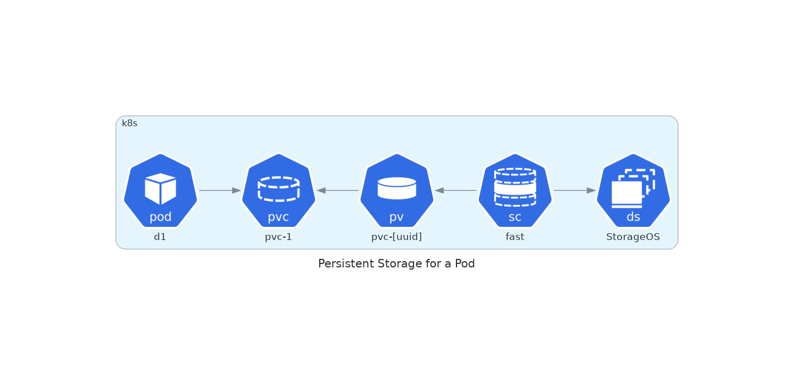
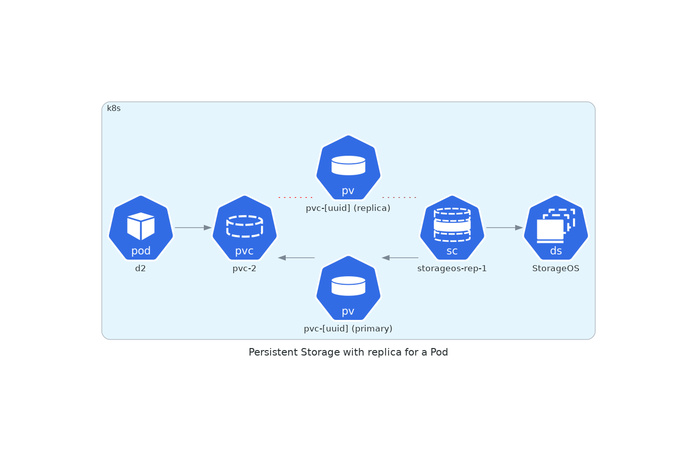

# basics of k8s and persistent storage

## connecting to k8s
The first component to connect to k8s platform is [kubectl](https://kubernetes.io/docs/tasks/tools/install-kubectl-linux/), the link provides the installation methodology based on the operating system.  
The second component to connect is a config file also referred as kubeconfig which presents itself as yaml file. If on linux machine, the file is usually found in: 
``` 
ls -al ~/.kube/
```
The file can save in that path under the name config or any other that can be exported as an environment variable as such:
```
export KUBECONFIG=~/.kube/file_name 
```
like so if the file was called ```digitalocean```: 
```
export KUBECONFIG=~/.kube/digitalocean
```
Once exported, ```kubectl``` can be used to verify connectivity:
```
kubectl get nodes
```
```
NAME          STATUS   ROLES    AGE   VERSION
dbaas-8row6   Ready    <none>   54m   v1.20.2
dbaas-8rowa   Ready    <none>   54m   v1.20.2
dbaas-8rowe   Ready    <none>   54m   v1.20.2
```
This output shows a 3 node cluster running a kubernetes version 1.20.2 freshly deployed ready to schedule workload.

## deploying a persistent storage solution
K8s is designed to support stateless workload natively. To support stateful workload, a persistent storage solution has to be implemented in order to provide a volume to be consummed by the application. The volume will survice the application rescheduling, scaling up/down, or deletion.  
[StorageOS](https://storageos.com) is cloud native, software-defined storage for running containerized applications in production, running in the cloud, on-prem and in hybrid/multi-cloud environments. 

[StorageOS](https://storageos.com) has a free forever developer tier that can be used for such environment or for a development platform. A [self evaluation guide](https://docs.storageos.com/docs/self-eval/) provides the user with a script to do a rapid deployment which will consume local disk space on nodes while providing a fully distributed persistent storage for stateful applications. Remember, this is not suited for a production deployment but performed for testing. 

From the admin machine where ```kubectl``` is connected with freshly deployed k8s cluster, the following script can be ran:
```
curl -sL https://storageos.run | bash
```
Wait! Be brave, don't just copy/paste the above... curl first, review and then execute.

The output would like like:
```
curl -sL https://storageos.run |bash
```
```
Welcome to the StorageOS quick installation script.
I will install StorageOS version v2.4.0-rc.1 into
namespace kube-system now. If I encounter any errors
I will stop immediately.

Creating etcd namespace storageos-etcd
namespace/storageos-etcd created
Creating etcd ClusterRole and ClusterRoleBinding
clusterrolebinding.rbac.authorization.k8s.io/etcd-operator created
clusterrole.rbac.authorization.k8s.io/etcd-operator created
Creating etcd operator Deployment
deployment.apps/etcd-operator created
Creating etcd cluster in namespace storageos-etcd
etcdcluster.etcd.database.coreos.com/storageos-etcd created
Installing StorageOS Operator version v2.4.0-rc.1
Warning: apiextensions.k8s.io/v1beta1 CustomResourceDefinition is deprecated in v1.16+, unavailable in v1.22+; use apiextensions.k8s.io/v1 CustomResourceDefinition
customresourcedefinition.apiextensions.k8s.io/storageosclusters.storageos.com created
customresourcedefinition.apiextensions.k8s.io/storageosupgrades.storageos.com created
customresourcedefinition.apiextensions.k8s.io/jobs.storageos.com created
customresourcedefinition.apiextensions.k8s.io/nfsservers.storageos.com created
namespace/storageos-operator created
clusterrole.rbac.authorization.k8s.io/storageos-operator created
serviceaccount/storageoscluster-operator-sa created
Warning: rbac.authorization.k8s.io/v1beta1 ClusterRoleBinding is deprecated in v1.17+, unavailable in v1.22+; use rbac.authorization.k8s.io/v1 ClusterRoleBinding
clusterrolebinding.rbac.authorization.k8s.io/storageoscluster-operator-rolebinding created
deployment.apps/storageos-cluster-operator created
Operator installed, waiting for pod to become ready
StorageOS Operator installed successfully
Creating Secret definining the API Username and Password
secret/storageos-api created
Installing StorageOS Cluster version v2.4.0-rc.1
storageoscluster.storageos.com/self-evaluation created
Waiting for StorageOS pods to become ready
Waiting for StorageOS pods to become ready
Waiting for StorageOS pods to become ready
Waiting for StorageOS pods to become ready
Waiting for StorageOS pods to become ready
StorageOS Cluster installed successfully
Deploying the StorageOS CLI as a pod in the kube-system namespace
pod/cli created
Waiting for the cli pod to become ready
StorageOS CLI pod is running
Your StorageOS Cluster now is up and running!

Now would be a good time to deploy your first volume - see
https://docs.storageos.com/docs/self-eval/#a-namestorageosvolumeaprovision-a-storageos-volume
for an example of how to mount a StorageOS volume in a pod

Don't forget to license your cluster - see https://docs.storageos.com/docs/operations/licensing/

This cluster has been set up with an etcd based on ephemeral
storage. It is suitable for evaluation purposes only - for
production usage please see our etcd installation nodes at
https://docs.storageos.com/docs/prerequisites/etcd/
```

Let's verify the status of the StorageOS cluster within our k8s cluster:
```
kubectl exec -n kube-system -it cli -- storageos get cluster
```
```
ID:           ed08d40e-5035-4270-81bd-2af74d53b5f8
Created at:   2021-05-07T09:32:40Z (2 minutes ago)
Updated at:   2021-05-07T09:32:40Z (2 minutes ago)
Nodes:        3
  Healthy:    3
  Unhealthy:  0
```

## my first app - show me the YAML
Before starting to run, let's have a little walk. The following example is from the actual [StorageOS](https://storageos.com) self evaluation guide providing two YAML definition for creating a Persistent Volume Claim (PVC) and an application (Pod) that will consume the persistent volume (PV). 

The following diagram shows the expected results:  



This first configuration file is also perfect to demonstrate the anatomy of YAML body parts:

```yaml
---
apiVersion: v1                              |> calling for a specific version of k8s api
kind: PersistentVolumeClaim                 |> what do we want to configure 
metadata:                                   |
  name: pvc-1                               |> metadata configures name, namespace, labels, annotations   
spec:                                       |
  storageClassName: "fast"                  |
  accessModes:                              |
    - ReadWriteOnce                         |> spec defines the desired state of the object, here the PVC
  resources:                                |  some objects accept changes by simply changing the properties 
    requests:                               |  and reapplying the YAML configuration file
      storage: 5Gi                          |
```
Note: YAML is really sensible about indentation, if not rigous about it, errors will be thrown at the CLI.

Here is the usable copy/paste version of the above ```myfirstpvc.yaml```:
```yaml
---
apiVersion: v1
kind: PersistentVolumeClaim
metadata:
  name: pvc-1
spec:
  storageClassName: "fast"
  accessModes:
    - ReadWriteOnce
  resources:
    requests:
      storage: 5Gi
```

The above provides a "voucher" with the name "pvc-1" for the application to get a volume of 5GB out of the storage class called "fast". This would be the most simplistic attempt to explain a PVC.  

```myfirstpod.yaml```: 
```yaml
---
apiVersion: v1
kind: Pod
metadata:
  name: d1
spec:
  containers:
    - name: debian
      image: debian:9-slim
      command: ["/bin/sleep"]
      args: [ "3600" ]
      volumeMounts:
        - mountPath: /mnt
          name: v1
  volumes:
    - name: v1
      persistentVolumeClaim:
        claimName: pvc-1
```

The above provides a blueprint of our application. It tells that we will be getting a debian container base image with a specific nature (9-slim), that we will run a command once up and that we want to redeem our volume voucher and mounting the volume at ```/mnt```.

Notes:
- note the comment structure of the descriptive configuration file. This is a well-documented standard. 
- two files are created but both YAML code could be append within the same file based on the above output. 

## my first app - show me the running YAML
To actually deploy the first app configuration, the following command can be executed:

```
kubectl apply -f doc/101/myfirstapp/myfirstpvc.yaml
```
```
persistentvolumeclaim/pvc-1 created
```
```
kubectl apply -f doc/101/myfirstapp/myfirstpod.yaml
```
```
pod/d1 created
```
Wow! no fireworks or music? nope... it just did it! 

The results will be two objects that are linked together:
```
kubectl get pvc
NAME    STATUS   VOLUME                                     CAPACITY   ACCESS MODES   STORAGECLASS   AGE
pvc-1   Bound    pvc-f4af80a7-1224-4641-abae-8403e3c9827b   5Gi        RWO            fast           86s

kubectl get pod
NAME   READY   STATUS    RESTARTS   AGE
d1     1/1     Running   0          95s
```

Since we are leverage [StorageOS](https://storageos.com), let's have a look at the volume from its view: 
```
kubectl exec -n kube-system -it cli -- storageos get volume 
NAMESPACE  NAME                                      SIZE     LOCATION              ATTACHED ON  REPLICAS  AGE      
default    pvc-f4af80a7-1224-4641-abae-8403e3c9827b  5.0 GiB  dbaas-8rowa (online)               0/0       1 day ago
```
Compared to ```kubectl get pvc```, there are two interesting additional details; location in terms of node and replicas.

## illustrate persistent storage
The goal of this first app is to provide an undestanding of the different objects like PVC, PV, or Pod and then illustrate the ephemeral nature of a Pod. 

Let's connect to the running pod and save some important message on our volume.
```
kubectl exec -it d1 -- bash

root@d1:/# mount |grep mnt
/var/lib/storageos/volumes/v.692c7205-3fab-4e37-969f-27e0b0268776 on /mnt type ext4 (rw,relatime,stripe=32)

root@d1:/# echo k8s rocks! > /mnt/motd

root@d1:/# cat /mnt/motd
k8s rocks!
root@d1:/# cat /etc/motd

The programs included with the Debian GNU/Linux system are free software;
the exact distribution terms for each program are described in the
individual files in /usr/share/doc/*/copyright.

Debian GNU/Linux comes with ABSOLUTELY NO WARRANTY, to the extent
permitted by applicable law.

root@d1:/# echo k8s rocks! > /etc/motd

root@d1:/# cat /etc/motd
k8s rocks!

root@d1:/# exit
```

The important message has been saved at two different places:
- the famous ```/etc``` directory where the motd file would be expected, which is now modified with our important message
- the ```/mnt``` directory where the persistent volume is mounted

Let's destroy the Pod and observe the container image ephemeral nature:
```
kubectl delete pod d1
pod "d1" deleted

kubectl get pod
No resources found in default namespace.

kubectl get pvc
NAME    STATUS   VOLUME                                     CAPACITY   ACCESS MODES   STORAGECLASS   AGE
pvc-1   Bound    pvc-f4af80a7-1224-4641-abae-8403e3c9827b   5Gi        RWO            fast           13m
```
The above output confirms that the Pod is delete but the PVC and volume still exist. The beauty of Kubernetes and it's descriptive desired state configuration file is that it can be applied again and the very same Pod will start and attach to the volume:

```
kubectl apply -f doc/101/myfirstapp/myfirstpod.yaml
pod/d1 created

kubectl get pod
NAME   READY   STATUS              RESTARTS   AGE
d1     0/1     ContainerCreating   0          4s

kubectl get pod
NAME   READY   STATUS    RESTARTS   AGE
d1     1/1     Running   0          12s
```

Let's check on our motd:

``` 
kubectl exec -it d1 -- bash
root@d1:/# mount |grep mnt
/var/lib/storageos/volumes/v.692c7205-3fab-4e37-969f-27e0b0268776 on /mnt type ext4 (rw,relatime,stripe=32)

root@d1:/# cat /mnt/motd
k8s rocks!

root@d1:/# cat /etc/motd

The programs included with the Debian GNU/Linux system are free software;
the exact distribution terms for each program are described in the
individual files in /usr/share/doc/*/copyright.

Debian GNU/Linux comes with ABSOLUTELY NO WARRANTY, to the extent
permitted by applicable law.

root@d1:/# exit
```

The above output confirms that a container image is indeed ephemeral and will discard any changes when deleted and redeployed versus having a persistent storage that can keep data across multiple scenarios from life-cycle, redeployment or failures.

If a PVC is a voucher for a volume, a container image is an ISO used for a LiveCD operating system, the Pod, and no data being generated during the usage of the LiveCD will be kept and written on the ISO for later on.


## storageClass 
To deploy the first app, two files were used, one of them being the PVC configuration file which as a reference to ```storageClassName```:

```myfirstpvc.yaml```:
```yaml
---
apiVersion: v1
kind: PersistentVolumeClaim
metadata:
  name: pvc-1
spec:
  storageClassName: "fast"                  |> reference to storageClass "fast"
  accessModes:
    - ReadWriteOnce
  resources:
    requests:
      storage: 5Gi
```

The reference is made towards the ```storageClass``` called "fast". Let's investigate about it the ```kubectl get``` command:

```
kubectl get storageClass 
NAME                         PROVISIONER                 RECLAIMPOLICY   VOLUMEBINDINGMODE   ALLOWVOLUMEEXPANSION   AGE
do-block-storage (default)   dobs.csi.digitalocean.com   Delete          Immediate           true                   43h
fast                         csi.storageos.com           Delete          Immediate           true                   28h
```
The output shows two ```storageClass``` including "fast" one which is using our [StorageOS](https://storageos.com) cluster. Let's dig for further details with ```kubectl describe```:
```
kubectl describe storageClass fast
Name:                  fast
IsDefaultClass:        No
Annotations:           <none>
Provisioner:           csi.storageos.com
Parameters:            csi.storage.k8s.io/controller-expand-secret-name=csi-controller-expand-secret,csi.storage.k8s.io/controller-expand-secret-namespace=kube-system,csi.storage.k8s.io/controller-publish-secret-name=csi-controller-publish-secret,csi.storage.k8s.io/controller-publish-secret-namespace=kube-system,csi.storage.k8s.io/fstype=ext4,csi.storage.k8s.io/node-publish-secret-name=csi-node-publish-secret,csi.storage.k8s.io/node-publish-secret-namespace=kube-system,csi.storage.k8s.io/provisioner-secret-name=csi-provisioner-secret,csi.storage.k8s.io/provisioner-secret-namespace=kube-system
AllowVolumeExpansion:  True
MountOptions:          <none>
ReclaimPolicy:         Delete
VolumeBindingMode:     Immediate
Events:                <none>
```
Nothing really super interesting to see, the "fast" class is a simple one volume without any protection. What about adding a new class with one replica.  

Why? Well, in this any setup, including this one, having a volume with no replica expose the application with no resiliency in case of failure. If the volume is being hosted on node 1 and node 1 fails, the application will be rescheduled by k8s to another available healthy node but failed because there is no copy of the application volume. Adding a replica will ensure resiliency and high availability ofr the application.

The following diagram shows the expected results:  




Here is an example of a one replica storage class ```replica_storageos_storageClass.yaml```:
```yaml
---
apiVersion: storage.k8s.io/v1
kind: StorageClass
metadata:
  name: storageos-rep-1
provisioner: csi.storageos.com
allowVolumeExpansion: true
parameters:
  fsType: ext4
  pool: default
  storageos.com/replicas: "1"
  csi.storage.k8s.io/controller-expand-secret-name: csi-controller-expand-secret
  csi.storage.k8s.io/controller-publish-secret-name: csi-controller-publish-secret
  csi.storage.k8s.io/node-publish-secret-name: csi-node-publish-secret
  csi.storage.k8s.io/provisioner-secret-name: csi-provisioner-secret
  csi.storage.k8s.io/controller-expand-secret-namespace: kube-system
  csi.storage.k8s.io/controller-publish-secret-namespace: kube-system
  csi.storage.k8s.io/node-publish-secret-namespace: kube-system
  csi.storage.k8s.io/provisioner-secret-namespace: kube-system
  ``` 

Time to apply:
```
kubectl apply -f doc/101/storageClass/replica_storageos_storageClass.yaml 
storageclass.storage.k8s.io/storageos-rep-1 created

kubectl get storageClass 
NAME                         PROVISIONER                 RECLAIMPOLICY   VOLUMEBINDINGMODE   ALLOWVOLUMEEXPANSION   AGE
do-block-storage (default)   dobs.csi.digitalocean.com   Delete          Immediate           true                   43h
fast                         csi.storageos.com           Delete          Immediate           true                   28h
storageos-rep-1              csi.storageos.com           Delete          Immediate           true                   6s

kubectl describe storageClass storageos-rep-1
Name:            storageos-rep-1
IsDefaultClass:  No
Annotations:     kubectl.kubernetes.io/last-applied-configuration={"allowVolumeExpansion":true,"apiVersion":"storage.k8s.io/v1","kind":"StorageClass","metadata":{"annotations":{},"name":"storageos-rep-1"},"parameters":{"csi.storage.k8s.io/controller-expand-secret-name":"csi-controller-expand-secret","csi.storage.k8s.io/controller-expand-secret-namespace":"kube-system","csi.storage.k8s.io/controller-publish-secret-name":"csi-controller-publish-secret","csi.storage.k8s.io/controller-publish-secret-namespace":"kube-system","csi.storage.k8s.io/node-publish-secret-name":"csi-node-publish-secret","csi.storage.k8s.io/node-publish-secret-namespace":"kube-system","csi.storage.k8s.io/provisioner-secret-name":"csi-provisioner-secret","csi.storage.k8s.io/provisioner-secret-namespace":"kube-system","fsType":"ext4","pool":"default","storageos.com/replicas":"1"},"provisioner":"csi.storageos.com"}

Provisioner:           csi.storageos.com
Parameters:            csi.storage.k8s.io/controller-expand-secret-name=csi-controller-expand-secret,csi.storage.k8s.io/controller-expand-secret-namespace=kube-system,csi.storage.k8s.io/controller-publish-secret-name=csi-controller-publish-secret,csi.storage.k8s.io/controller-publish-secret-namespace=kube-system,csi.storage.k8s.io/node-publish-secret-name=csi-node-publish-secret,csi.storage.k8s.io/node-publish-secret-namespace=kube-system,csi.storage.k8s.io/provisioner-secret-name=csi-provisioner-secret,csi.storage.k8s.io/provisioner-secret-namespace=kube-system,fsType=ext4,pool=default,storageos.com/replicas=1
AllowVolumeExpansion:  True
MountOptions:          <none>
ReclaimPolicy:         Delete
VolumeBindingMode:     Immediate
Events:                <none>
```

The ```storageClass``` parameters are shown in the describe as ```fsType=ext4,pool=default,storageos.com/replicas=1```. The two previous PVC and Pod configuration files are updated to leverage this new ```storageClass```.

```pvc-with-replica.yaml```:
```yaml
---
apiVersion: v1
kind: PersistentVolumeClaim
metadata:
  name: pvc-2
spec:
  storageClassName: "storageos-rep-1"
  accessModes:
    - ReadWriteOnce
  resources:
    requests:
      storage: 5Gi
```
```pod-with-pvc-replica.yaml```:
```yaml
---
apiVersion: v1
kind: Pod
metadata:
  name: d2
spec:
  containers:
    - name: debian
      image: debian:9-slim
      command: ["/bin/sleep"]
      args: [ "3600" ]
      volumeMounts:
        - mountPath: /mnt
          name: v1
  volumes:
    - name: v1
      persistentVolumeClaim:
        claimName: pvc-2
```
Let's apply them:
```
kubectl apply -f doc/101/storageClass/pvc-with-replica.yaml 
persistentvolumeclaim/pvc-2 created

kubectl apply -f doc/101/storageClass/pod-with-pvc-replica.yaml 
pod/d2 created

kubectl get pod
NAME   READY   STATUS    RESTARTS   AGE
d1     1/1     Running   0          56s
d2     1/1     Running   0          106s

kubectl get pvc
NAME    STATUS   VOLUME                                     CAPACITY   ACCESS MODES   STORAGECLASS      AGE
pvc-1   Bound    pvc-f4af80a7-1224-4641-abae-8403e3c9827b   5Gi        RWO            fast              28h
pvc-2   Bound    pvc-3e303b09-dc6f-4cf7-b46a-d368463f629c   5Gi        RWO            storageos-rep-1   105s

kubectl exec -n kube-system -it cli -- storageos get volume 
NAMESPACE  NAME                                      SIZE     LOCATION              ATTACHED ON  REPLICAS  AGE          
default    pvc-3e303b09-dc6f-4cf7-b46a-d368463f629c  5.0 GiB  dbaas-8row6 (online)  dbaas-8row6  1/1       3 minutes ago
default    pvc-f4af80a7-1224-4641-abae-8403e3c9827b  5.0 GiB  dbaas-8rowa (online)  dbaas-8rowa  0/0       1 day ago    
```

As we can see the new PVC is now leveraging the new created class ```storageos-rep-1``` providing a replica to the workload. The tests realized during ```myfirstapp``` can be done again with the very same results.  On top of this, if the node ```dbaas-8row6``` would suffer a failure, the replica would be elected as primary volume to ensure the Pod can continue to work and access its data.

## conclusions
k8s and containers are solving a massive amount of infrastructure dependencies. With the above example, it might not be that abvious. The next part of the guide will make sure to highlight the major benefits compared to the legacy way of deployments.

From this 101 part, the followings are to keep in mind:
- k8s and containers are designed to run out-of-the-boxe stateless applications
- YAML is picky with indentation, using a good text editor with YAML linting is almost mandatory
- a cloud native solution like [StorageOS](https://storageos.com) provides a k8s native storage solution for stateful applications
- using k8s with [StorageOS](https://storageos.com) allows to address storage needs from YAML templating without needs of any extra knowledge
